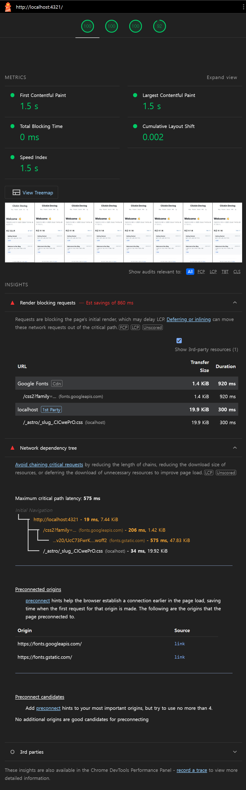
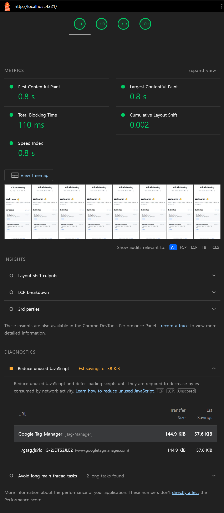

## 1) 문제 진단

블로그 기능은 정상인데, 첫 화면이 뜨는 체감 속도가 아쉬웠습니다.
그래서 먼저 감이 아니라 지표로 확인하기 위해 Chrome DevTools의 Lighthouse를 Mobile 기준으로 측정했습니다.
Desktop은 상대적으로 유리하게 나오기 쉬워, 병목 판단은 Mobile 리포트를 기준으로 통일했습니다.

---

## 2) 원인 분석

먼저 이전 버전(before) 리포트에서 병목 지점 확인했습니다.

`before` 리포트에서 핵심 지표는 아래 두 가지였습니다.

- `render-blocking-insight`: `0.5`
  - block 리소스: `https://clickin.github.io/_astro/_slug_.FL87gRx2.css`
  - `totalBytes: 20172`, `wastedMs: 300`
- `cache-insight`: `0.5` (`Est savings of 18 KiB`)
  - 동일 CSS에서 `cacheLifetimeMs: 600000`, `wastedBytes: 18491`

추가로 코드 경로도 함께 점검했습니다.

- 폰트는 head에서 Google Fonts CSS를 외부 요청으로 가져오고 있었고,
  초기 렌더 시점에 폰트 연결/스타일시트 로딩 전략을 더 다듬을 여지가 있었습니다.
- 댓글(Giscus), 검색(Pagefind)처럼 "초기 렌더에 필수는 아닌" 기능 스크립트는
  페이지별로 네트워크/메인스레드 경쟁을 만들 수 있어 병목 후보로 분류했습니다.

즉 원인 분석 결론은 다음 3가지였습니다.

1. CSS 전달 경로(실제 Lighthouse insight로 확인)
2. 폰트 로딩 경로(초기 연결/스타일시트 전달 전략)
3. 부가 스크립트 로딩 시점(초기 렌더 경로와 분리 필요)

---

## 3) 해결책 도입

원인에 맞춰 아래 순서로 적용했습니다.

### 3-1. CSS 전달 경로 튜닝
CSS 병목의 원인은 약 20KB CSS가 별도 요청으로 render-blocking 구간에 걸렸다는 점이었습니다.
Astro/Vite는 작은 에셋을 inline으로 처리할 수 있지만, 기본 임계값(약 4KB)으로는 이 CSS가 대상이 아니었습니다.
`inlineStylesheets: "auto"`는 유지하고, 현재 사이트 규모에 맞춰 `assetsInlineLimit`을 30KB로 조정했습니다.

### 3-2. 폰트 로딩 경로 정리

폰트 경로는 "먼저 연결하고, 필요한 weight만 고정해 가져오고, 렌더 블로킹을 줄이는" 방향으로 정리했습니다.

- `preconnect`: `fonts.googleapis.com`, `fonts.gstatic.com`
- weight 고정: `Inter 400/500/600/700/800`, `JetBrains Mono 400/500`
- `display=swap` 사용
- 폰트 CSS는 `preload as=style` 후 `media="print" onload` 방식으로 비동기 적용

이 조합으로 초기 텍스트 표시 지연을 줄이고, 불필요한 폰트 변형 다운로드를 피했습니다.

### 3-3. 부가 스크립트 지연 로딩

댓글(Giscus), 검색(Pagefind)처럼 초기 렌더에 필수 아닌 부가기능은 사용자 맥락 시점으로 지연 로딩처리했습니다.
동시에 중복 초기화 방지, 재시도 UX, 테마 동기화 같은 기존 동작은 유지했습니다.

- Giscus: IntersectionObserver로 댓글 영역 근접 시점 로드
- Pagefind: 검색 페이지에서만 동적 스크립트 주입으로 초기 경로 분리

---

## 4) 최종 비교

동일 조건에서 현재 버전(after)을 다시 측정해 before와 비교했습니다.

핵심 비교 결과는 아래와 같습니다.

| 지표 | Before | After | 변화량 | 해석 |
|---|---:|---:|---:|---|
| Performance Score | 100 | 99 | -1 | Google Analytics 도입 오버헤드로 인한 오차범위 이내 변동 |
| FCP | 약 1.5 s | 약 0.8 s | 약 -0.7 s | 초기 표시 속도 개선 |
| TBT | 0 ms | 약 110 ms | +약 110 ms | Google Analytics 도입 오버헤드 |
| CLS | 0.0016297868335406703 | 0.0016297868335406703 | 0 | 안정성 유지 |

Insight도 동일하게 개선되었습니다.

- `render-blocking-insight`: `0.5 -> 1`
- `cache-insight`: `0.5 -> 1`

> TBT +약 110ms는 GA(`googletagmanager.com`, `google-analytics.com`) 도입으로 인한 추가 비용입니다.

---

## 마무리

이번 개선으로 체감상 거의 즉각적인 페이지 로딩을 달성했습니다.
보통 이렇게 외부 Asset에 의한 로딩 속도 문제는 cache header와 CDN으로 해결하는 편이었지만, 이번엔 github page를 사용하는데다 커스텀 도메인을 추가하지 않았기 때문에 cache control 및 cdn을 제가 제어할 수 없었습니다.
추가적인 비용을 지출하고 싶지는 않았기에 github page 시스템 내에서도 가능한 최적화만을 시도해보기로 했습니다. 만족스러운 결과를 얻었고 평소 사용하던 방식이 아닌 다른 방식을 시도해볼 수 있어서 재밌었던 작업이었습니다.
