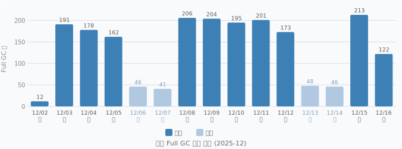
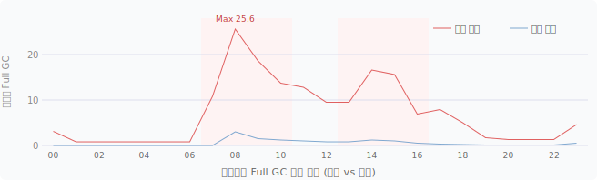

## 1) 시작: Full GC 2-3초, 2-3분 간격
저희 회사는 Spring legacy와 유사한 IoC, DI, AOP 시스템을 가진 사내 프레임워크를 사용하고 있습니다. 제가 사내 프레임워크 유지보수 담당자인데, 오랜 기간에 걸쳐 간헐적인 성능 저하 문의가 들어오다보니 성능 저하의 원인을 계속 모니터링하고 있었습니다.
jmx_exporter + prometheus + grafana 스택으로 모니터링하면서 메인 서비스의 gc 문제가 있다는 건 파악하고 있었지만 어떤 수정사항을 시도해볼지에 대한 근거가 없는 상태로 약 1년 넘게 방치되었죠.
다른 서비스 장애때문에 각종 로그를 살펴보다가 gc로그도 살펴봤는데 로그에 정보가 너무 없었습니다. 그래서 다른 서비스 장애를 복구하면서 jvm 옵션에 `PrintGCDetails` 을 추가하고 데이터를 모아 그동안 벼르고 있던 gc 문제를 파악해보기로 했죠.

상세한 gc로그를 약 2주간 수집하고 보니 상황이 그닥 좋지 않았습니다.
피크 시간대에 Full GC가 평균 2-3분 간격으로 발생하고, 한 번 터지면 2-3초씩 STW가 걸리고 있었습니다.
처음엔 "**MaxGCPauseMillis를 낮추면** Full GC 시간도 줄어들지 않을까?"라고 생각했습니다.

알고 보니 이건 잘못된 접근이었습니다.
`MaxGCPauseMillis`는 Young GC와 Mixed GC의 목표 중단 시간에만 영향을 줍니다. Full GC는 JVM이 마지막 수단으로 꺼내는 것이라 이 옵션이 Full GC 시간을 단축시키지 않습니다.
목표를 **"Full GC 시간 1초 이하"**에서 **"Full GC 자체를 없애기"**로 바꾸는 것이 첫 번째 전환점이었습니다.

---

## 2) GC 로그 정량화: 문제가 얼마나 심각한가

당시 JVM 옵션은 기본에 가까웠습니다.

```
-Xms8192m -Xmx8192m
-XX:NewRatio=2
-XX:+UseG1GC
-XX:+AlwaysPreTouch
-XX:MetaspaceSize=2048m -XX:MaxMetaspaceSize=2048m
-XX:+DisableExplicitGC
-verbose:gc -Xloggc:... -XX:+PrintGCDateStamps
```

앞서 말했듯이 `PrintGCDetails`를 추가하고 약 2주치 로그를 분석했더니 수치가 나왔습니다.

- **Full GC**: 10일 기준 약 1,500회, 평균 1.7s, max 3.9s, 피크 시간대에는 1-3분까지 gc trigger 간격이 줄어듦
- **Evacuation failure**: 같은 기간 약 24,000회, Young GC 실패율 약 26%
- **Humongous allocation pause**: 약 19,600회

Full GC 1,500회라는 숫자가 가장 충격적이었습니다.
그리고 Evacuation failure가 이렇게 많다는 건, Old Gen에 빈 region이 부족해서 Young GC가 객체를 옮기지 못한 채 실패하고 있었다는 의미입니다.
Full GC는 그 연장선에서 발생하고 있었습니다.

---

## 3) 코드 레벨 원인 분석

GC 로그는 결과를 확인하는 도구라 원인을 직접 추적하기 어렵습니다.
staging 환경에서 heap dump를 뽑아 [Eclipse MAT](https://eclipse.dev/mat/)으로 분석하고, 운영 환경에서 `async-profiler`로 힙 할당을 프로파일링했습니다.

분석 결과 배포 전에 수정할 코드 레벨 문제 4가지가 확인됐습니다.

1. **프레임워크 코어 ThreadLocal 누수** — 요청 처리 경로의 cleanup 누락
2. **외부 HTTP 클라이언트 라이브러리 ThreadLocal 누수** — JAX-RS 계열 라이브러리
3. **XML 파서 과도 생성** — 매 요청마다 파서 신규 생성
4. **번외: ArrayList / HashMap grow** — 컨테이너 크기 미지정으로 인한 반복 재할당

### Full GC 발생 패턴

튜닝 전 15일간 Full GC 일별 발생 횟수입니다. 평일 업무 시간대에 집중됩니다.



시간대별로 보면 피크는 업무 시작(08:00)과 오후 집중 시간대(14:00-16:00)입니다.



주말과 평일의 격차가 뚜렷합니다. 평일 피크 시간대에 시간당 평균 25회를 넘었고, 주말은 거의 0에 가깝습니다. **GC 문제가 인프라 부하가 아니라 업무 요청 트래픽에 직결**되어 있다는 뜻입니다.

### 원인 1: 프레임워크 코어 ThreadLocal 누수

heap dump에서 ThreadLocal 관련 보유 객체가 다수 확인됐습니다.
코드를 추적해보니, 사내 웹 프레임워크의 요청 처리 메인 메서드에 조기 리턴(early return) 경로가 여러 개 있었는데 이 경로들이 ThreadLocal 정리(cleanup) 코드를 건너뛰고 있었습니다.
스레드 풀 기반 WAS에서 이런 패턴은 ThreadLocal이 요청 사이에 그대로 남아서 Old Gen 객체로 장기 보유되는 메모리 누수를 만듭니다.

아래는 문제 패턴을 재현한 예시입니다. (실제 코드와 무관한 재현 코드)

```java
// 수정 전: 조기 리턴이 finally를 우회
public void processRequest(Request req) {
    setupContext(req);          // ThreadLocal에 컨텍스트 세팅

    if (isSpecialCommand(req)) {
        handleSpecialCommand();
        return;                 // ← cleanup() 호출 없이 리턴 // [!code --]
    }

    try {
        dispatch(req);
    } catch (Exception e) {
        handleError(e);
    }
    cleanup();                  // 정상 경로에만 도달 // [!code --]
}

// 수정 후: try-finally로 모든 경로에서 정리 보장
public void processRequest(Request req) {
    setupContext(req);

    try { // [!code ++]
        if (isSpecialCommand(req)) {
            handleSpecialCommand();
            return;             // finally가 실행됨
        }
        dispatch(req);
    } catch (Exception e) {
        handleError(e);
    } finally { // [!code ++]
        cleanup();              // 항상 실행 // [!code ++]
    } // [!code ++]
}
```

수정 후 "이걸 적용하면 Full GC가 얼마나 줄어들까?"라는 질문을 했습니다.
GC 분석 결과는 냉정했습니다.

ThreadLocal 누수가 Old Gen 압박에 기여하는 건 맞지만, 당시 Full GC의 주원인은 누수가 아니라 **GC 옵션 구성 자체**였습니다.
ThreadLocal 수정이 증상의 일부는 완화하겠지만, GC 옵션 변경 없이는 Full GC 패턴이 크게 달라지지 않을 것이라는 결론이었습니다.
그래서 두 작업을 같은 릴리즈에 묶기로 했습니다.

### 원인 2: JAX-RS 계열 라이브러리 ThreadLocal 누수

외부 REST 호출에 사용하는 JAX-RS 기반 HTTP 클라이언트 라이브러리가 스레드 풀 환경에서 ThreadLocal을 누수시키는 문제가 있었습니다.
JAX-RS 클라이언트는 스레드별 컨텍스트를 ThreadLocal에 저장하는데, 요청이 끝난 후 명시적으로 닫지 않으면 스레드 풀의 스레드에 계속 보유됩니다.

수정 방향: 구형 JAX-RS 1.x 계열 호출 코드를 일괄 수정하는 대신, 장기적인 관점에서 Apache HttpClient5[^httpclient] 기반으로 일괄 교체했습니다.

[^httpclient]: Apache HttpClient는 ThreadLocal 대신 명시적인 연결 관리 방식(PoolingHttpClientConnectionManager)을 사용하므로, 스레드 풀 환경에서 누수 없이 안전하게 사용할 수 있습니다.

### 원인 3: XML 파서 과도 생성

저희 회사는 주로 XML을 HTTP 요청/응답에 사용하는데, XML 파싱에 사용하는 외부 업체의 라이브러리가 매 요청마다 파서 인스턴스를 새로 생성하고 있었습니다.
XML 파서(특히 `SAXParser`, `DocumentBuilder` 계열)는 생성 비용이 크고 내부에 대형 버퍼를 보유하기 때문에, 요청량이 많은 피크 시간대에 이 객체가 반복 생성·소멸되면서 Old Gen 압박으로 이어지고 있었습니다.

수정 방향: 최신 버전의 파서는 스레드로컬 캐시를 활용하는걸 확인하여 신규 버전으로 교체했습니다.

### 번외: ArrayList 및 HashMap size 지정

저희 회사에서는 `ArrayList<HashMap<String, Object>>` 를 각 레이어 간에 데이터 전달용으로 사용합니다. 예를 들어 HTTP 요청 파싱이나, JDBC ResultSet 파싱 공통로직 등에서 이를 사용하죠.
기존 구현과 변경된 구현을 비교해보면 문제를 알 수 있습니다.

수정 전 코드에서는 ArrayList[^ArrayList]와 HashMap[^HashMap]의 bucket size를 지정하지 않고 모두 기본값으로 사용하는 문제가 있습니다. 데이터를 얼마나 추가할 지 모르는 상황이거나 없을 수 있다면 적절한 선택이지만, 현재 상황은 그렇지 않죠. HTTP 파싱에선 모든 항목의 갯수를 미리 알 수 있고, ResultSet 파싱 에서는 Column의 갯수를 알 수 있습니다.
[^ArrayList]: 기본값 크기로 최초는 0, 하나라도 원소를 추가한다면 10
[^HashMap]: 기본값 크기로 initial capacity 16, load factor 0.75
아래는 문제 패턴 재현 예시입니다. (실제 코드와 무관)

#### 1. HTTP parsing
```java
// 수정 전
public void doPost(HttpServletRequest request, HttpServletResponse response) {
    ParsedXMLRoot root = parseXML(request);
    // 내부 bean에게 전달하는 구조입니다.
    Map<String, List<Map<String, Object>>> parsedRequest = new HashMap<>(); // [!code --]
    for (DataContainer dc : root.getDataContainers()) {
      List<Map<String, Object>> request = new ArrayList<>(); // [!code --]
      for (DataRow row : dc.getRows()) {
        Map<String, Object> row = new HashMap<>(); // [!code --]
        for (DataCol col : row.getColumns) {
          row.put(col.name, getRealType(col)); // xml에는 각 col 마다 자신의 type을 지정하는 부분이 있습니다.
        }
        request.add(row);
      }
      parsedRequest.put(dc.getContainerName(), request);
    }
    BeanMetadata beanMetadata = BeanHelper.findCorrespondingBean(request); // target bean과 해당하는 method가 request 안에 담겨서 오는데, 이를 찾아서 판별해줍니다.
    Object processedResult = BeanHelper.invoke(beanMetadata, parsedRequest);
    resultMessageBuild(response, processedResult); // 실제 수행된 결과물을 다시 xml로 만들어 return합니다.
}

// 수정 후
public void doPost(HttpServletRequest request, HttpServletResponse response) {
    ParsedXMLRoot root = parseXML(request);
    // 내부 bean에게 전달하는 구조입니다.
    Map<String, List<Map<String, Object>>> parsedRequest = new HashMap<>(root.getDataContainerCount()); // [!code ++]
    for (DataContainer dc : root.getDataContainers()) {
      List<Map<String, Object>> request = new ArrayList<>(dc.getRowSize()); // [!code ++]
      for (DataRow row : dc.getRows()) {
        int bucketSize = (int) (row.getSize() / 0.75) + 1; // load factor를 감안해서 미리 정확하게 할당해줍니다. // [!code ++]
        Map<String, Object> row = new HashMap<>(bucketSize); // [!code ++]
        for (DataCol col : row.getColumns) {
          row.put(col.name, getRealType(col)); // xml에는 각 col 마다 자신의 type을 지정하는 부분이 있습니다.
        }
        request.add(row);
      }
      parsedRequest.put(dc.getContainerName(), request);
    }
    BeanMetadata beanMetadata = BeanHelper.findCorrespondingBean(request); // target bean과 해당하는 method가 request 안에 담겨서 오는데, 이를 찾아서 판별해줍니다.
    Object processedResult = BeanHelper.invoke(beanMetadata, parsedRequest);
    resultMessageBuild(response, processedResult); // 실제 수행된 결과물을 다시 xml로 만들어 return합니다.
}
```

#### 2. ResultSet fetch
```java
// 수정 전
pubic List<Map<String, Object>> fetchData() {
  // PreparedStatement 작성부분 skip
  ResultSet rs = psmt.executeQuery();
  // ResultSetMetaData 를 기반으로 Column name과 index를 매핑해놓습니다.
  ColumnHeader[] cols = buildColumnHeader(rs.getMetaData());
  List<Map<String, Object>> result = new ArrayList<>();
  while (rs.next()) {
    HashMap<String, Object> row = new HashMap<>(); // [!code --]
    for (ColumHeader col : col) {
      row.put(col.name, extractUsingSwitch(rs, col.index)); // 해당 column의 타입을 기반으로 switch 구문을 사용하여 올바른 타입으로 가져옵니다.
    }
    result.add(row);
  }
  return result;
}
// 수정 후
pubic List<Map<String, Object>> fetchData() {
  // PreparedStatement 작성부분 skip
  ResultSet rs = psmt.executeQuery();
  // ResultSetMetaData 를 기반으로 Column name과 index를 매핑해놓습니다.
  ColumnHeader[] cols = buildColumnHeader(rs.getMetaData());
  int bucketSize = (int) (cols / 0.75) + 1; // [!code ++]
  // SELECT query의 row 갯수를 미리 알려면 last() 를 사용해 cursor를 맨 끝으로 가서 getRow() 를 실행해야합니다. 이 과정의 오버헤드가 더 크기 때문에 이 구간에서는 size를 미리 지정하지 않습니다.
  List<Map<String, Object>> result = new ArrayList<>();
  while (rs.next()) {
    HashMap<String, Object> row = new HashMap<>(bucketSize); // [!code ++]
    for (ColumHeader col : col) {
      row.put(col.name, extractUsingSwitch(rs, col.index)); // 해당 column의 타입을 기반으로 switch 구문을 사용하여 올바른 타입으로 가져옵니다.
    }
    result.add(row);
  }
  return result;
}
```


다음은 수정된 방식의 예시입니다.(동일하게 실제 코드와 무관)

#### 1. HTTP parsing(revised)
```java
public void doPost(HttpServletRequest request, HttpServletResponse response) {
    ParsedXMLRoot root = parseXML(request);
    // 내부 bean에게 전달하는 구조입니다.
    Map<String, List<Map<String, Object>>> parsedRequest = new HashMap<>(root.getDataContainerCount()); // [!code ++]
    for (DataContainer dc : root.getDataContainers()) {
      List<Map<String, Object>> request = new ArrayList<>(dc.getRowSize()); // [!code ++]
      for (DataRow row : dc.getRows()) {
        int bucketSize = (int) (row.getSize() / 0.75) + 1; // load factor를 감안해서 미리 정확하게 할당해줍니다. // [!code ++]
        Map<String, Object> row = new HashMap<>(bucketSize); // [!code ++]
        for (DataCol col : row.getColumns) {
          row.put(col.name, getRealType(col)); // xml에는 각 col 마다 자신의 type을 지정하는 부분이 있습니다.
        }
        request.add(row);
      }
      parsedRequest.put(dc.getContainerName(), request);
    }
    BeanMetadata beanMetadata = BeanHelper.findCorrespondingBean(request); // target bean과 해당하는 method가 request 안에 담겨서 오는데, 이를 찾아서 판별해줍니다.
    Object processedResult = BeanHelper.invoke(beanMetadata, parsedRequest);
    resultMessageBuild(response, processedResult); // 실제 수행된 결과물을 다시 xml로 만들어 return합니다.
}
```


---

## 4) GC 레벨 원인 분석: Humongous Object와 Evacuation Failure

두 번째 원인은 humongous 객체[^humongous]였습니다.

[^humongous]: G1GC에서 Region 크기의 50%를 초과하는 객체를 Humongous Object라 부릅니다. Young Gen을 거치지 않고 Old Gen에 직접 할당되며, 일반 Young GC로는 회수되지 않습니다. Region 경계를 넘는 경우 여러 Region을 연속으로 점유(Humongous Region)하기 때문에, 빈번하게 발생하면 힙 단편화와 Evacuation failure의 원인이 됩니다.

이 서비스는 DB 결과나 XML 변환 결과를 `List<Map<String, Object>>` 구조로 처리하는데, Value의 대부분이 String입니다.
응답 규모에 따라 페이지 전체 HTML이나 XML 청크가 하나의 큰 String으로 생성되는 경우가 있었습니다. 앞서 언급한 heap dump를 [eclipse MAT](https://eclipse.dev/mat/) 툴로 분석해보니 4MB 정도의 char[] 가 많이 관측되었죠.

당시 G1HeapRegionSize를 명시하지 않았기 때문에, 8GB 힙에서 JVM이 기본으로 선택한 region 크기는 약 **4MB**였습니다.
G1에서 humongous 임계는 Region의 50%이므로, **2MB 이상 객체는 모두 humongous** 취급을 받았습니다.
그러면 Young Gen을 거치지 않고 Old Gen에 직접 할당되고, Young GC로는 회수되지 않습니다.
10일간 humongous 이벤트 19,600회라는 숫자는 이 패턴의 결과였습니다.

Evacuation failure는 humongous 객체가 Old Gen에 쌓이면서 빈 region이 부족해진 결과였고, Full GC는 그 다음 단계였습니다.

---

## 5) GC 옵션 변경

문제를 파악한 뒤 옵션을 하나씩 결정했습니다.

### Heap 크기: 8GB → 16GB

호스트 물리 메모리가 충분하고, 동일 호스트에서 동작하는 인스턴스 수를 고려해도 여유가 있었습니다.
힙이 커지면 Full GC가 발생했을 때 STW가 길어지는 트레이드오프가 있지만, 목표 자체를 Full GC 제거로 잡았기 때문에 감수할 수 있는 트레이드오프였습니다.

### G1HeapRegionSize: (미설정) → 8m

16GB 힙에서 JVM 기본값으로 결정되는 region 크기를 명시로 고정했습니다.
Humongous 임계가 2MB → **4MB로 올라가서**, 2-4MB 객체들이 humongous 취급을 벗어날 수 있습니다.

Region을 16m으로 더 키우는 것도 검토했습니다. 임계가 8MB로 올라가면 humongous 빈도가 더 줄어들겠지만, region 수가 절반으로 줄어들어 Mixed GC의 granularity가 떨어지는 단점이 있습니다. 당시 상황에서는 8m이 적절한 균형이라 판단했습니다.

### G1ReservePercent: (기본 10%) → 20%

빈 region 예비 공간을 두 배로 늘렸습니다. Evacuation failure의 직접 원인이 빈 region 부족이었으므로, 안전 마진을 늘리는 것이 우선이었습니다.

### IHOP: (기본 45%) → 30%

Old Gen이 힙의 45%를 채울 때 Concurrent Marking을 시작하는 기본 동작에서, 30%로 낮춰 더 일찍 시작하도록 했습니다.

기존 상황에서는 Marking이 충분히 시작되기 전에 힙이 가득 차서 Full GC가 먼저 터지는 패턴이 반복됐습니다. 조기 시작으로 Mixed GC가 준비될 시간을 확보하는 것이 목적입니다.

### NewRatio=2 삭제

G1GC에서 `-XX:NewRatio`로 Young/Old 비율을 고정하는 건 G1의 ergonomics를 방해합니다.
G1은 pause 목표에 맞춰 Young 크기를 자동으로 조정하는데, 고정 비율이 이것을 막습니다.
"Young을 넓히면 더 많은 객체가 young에서 소멸되지 않을까?"라는 접근도 검토했지만, Old를 줄이면 evacuation failure가 더 빨리 오는 역효과가 있었습니다. 결국 삭제하고 G1에 맡기는 쪽이 맞다는 결론이었습니다.

### GC 로그 옵션 정리

`PrintGCDetails`를 추가해 GC 내부 phase별 시간이 찍히도록 했습니다.

한 가지 실수가 있었는데, `-XX:+PrintGCApplicationStoppedTime`을 추가했더니 초당 수 건씩 safepoint 로그가 쏟아졌습니다. GC 이벤트 로그가 아니라 전체 JVM safepoint 진입 이력을 찍는 옵션이었습니다. 바로 제거했습니다.

---

## 6) 1차 적용 후: Full GC 0회

코드 3종(프레임워크 ThreadLocal, JAX-RS 교체, XML 파서 교체) + GC 옵션 변경을 한 릴리즈에 묶어 배포했습니다.
변경 적용 후 12일치 GC 로그를 다시 분석했습니다.

- **Full GC: 12일간 0회**
- **Evacuation failure: 12일간 0회**
- **Mixed GC 최초 관측**: 기동 3일 후 `concurrent-mark-start` → Mixed GC 연속 발생
- **Mixed GC 효과**: Old Gen 3.2GB → 2.0GB (1.2GB 회수), 평균 소요 5ms
- **Humongous Register**: 9,490회, **Humongous Allocation failure: 9회**

Full GC가 사라졌다는 것보다, `concurrent-mark-start` → Mixed GC → Old Gen 회수라는 G1의 정상 경로가 처음으로 제대로 동작하고 있다는 사실이 중요했습니다.
기존에는 이 경로가 완성되기 전에 Full GC가 먼저 터지기에 Mixed GC가 관측된 적이 없었습니다.

Humongous allocation failure가 9회(12일간)에 불과한 것도 의미 있는 수치입니다. 현재 Region 크기와 Reserve 마진이 이 서비스의 humongous 패턴을 충분히 소화하고 있다는 뜻입니다.

---

## 7) 후속 발견: CLOB/BLOB Reader 패치

1차 적용 결과를 모니터링하던 중 추가 문제를 발견했습니다.
GC 로그 분석과 `async-profiler` 프로파일링 결과, `char[]`와 `byte[]`를 지속적으로 생성하여 GC 압력이 높아지는 패턴이 남아 있었습니다.

원인을 추적해보니, DB에서 CLOB/BLOB을 읽는 Reader 구현이 `char[]/byte[]`를 매번 두 배씩 늘려가며 새로 할당하는 방식으로 작성되어 있었습니다.

아래는 문제 패턴 재현 예시입니다. (실제 코드와 무관)

```java
// 문제 패턴: char[]를 반복 확장하며 복사
public String readClob(Reader reader) throws IOException {
    char[] buf = new char[1024];
    int totalRead = 0;
    int n;
    while ((n = reader.read(buf, totalRead, buf.length - totalRead)) != -1) {
        totalRead += n;
        if (totalRead == buf.length) {
            char[] bigger = new char[buf.length * 2]; // 매번 새 배열 할당 // [!code --]
            System.arraycopy(buf, 0, bigger, 0, buf.length); // [!code --]
            buf = bigger; // [!code--]
        }
    }
    return new String(buf, 0, totalRead); // [!code --]
}

// 수정 후: StringBuilder로 배열 복사 없이 누적
public String readClob(Reader reader) throws IOException {
    char[] buf = new char[1024]; 
    StringBuilder sb = new StringBuilder(); // [!code ++]
    int n;
    while ((n = reader.read(buf)) != -1) { // [!code ++]
        sb.append(buf, 0, n); // 실제 읽은 만큼만 누적 // [!code ++]
    }
    return sb.toString(); // [!code ++]
}
```

실제 운영 환경에서 오라클 SQL 쿼리 하나로 CLOB를 사용해 A4용지 기준 100페이지 이상인 HTML을 생성하는 경우가 종종 있는데, 앞선 로직에서 이 배열이 수십-수백 회 재할당되고, 최종 결과물 역시 4MB 가량의 `char[]`가 됩니다.
`G1HeapRegionSize=8m` 환경에서는 중간 단계에서 사용한 여러 배열들이 gc 압박을 가하는데다 마지막으로 생성된 4MB 이상 배열이 humongous 대상이 되어 Young GC를 우회해 Old Gen에 직접 쌓입니다.

수정 방향: `StringBuilder` 또는 크기 추정 후 단일 배열 할당 방식으로 교체했습니다.
이 패치까지 적용한 뒤 전 서버에 순차 배포를 완료했습니다.

---

## 8) outlier 원인 분석

Full GC는 사라졌지만, Young GC에서 40-65ms짜리 outlier가 간헐적으로 남아있었습니다. 평상시 Young GC가 10-20ms인 것과 비교하면 2-3배 수준입니다.

65ms outlier의 GC 로그를 뜯어봤습니다.

```
[GC pause (G1 Evacuation Pause) (young), 0.0651408 secs]
[Parallel Time: 49.3 ms, GC Workers: 13]
  [Update RS (ms): Avg 28.8, Max 30.9]
  [Processed Buffers: Sum 1540]
  [Object Copy (ms): Avg 9.2]
[Other: 14.9 ms]
[Humongous Register: 3.6 ms]
[Humongous Reclaim: 2.4 ms]
```

Parallel Time 49.3ms 중 Update RS가 28.8ms를 차지하고 있었습니다.
Object Copy는 9.2ms로, 복사 자체는 주범이 아니었습니다.

Update RS는 Old→Young 방향 참조 변경사항(dirty card)을 Young GC 전에 반영하는 단계입니다.
Processed Buffers가 1540이라는 건 그만큼 dirty card가 누적됐다는 의미입니다.
Eden이 큰 상태에서 90초 간격으로 GC가 돌기 때문에, dirty card가 많이 쌓인 타이밍에 GC가 걸리면 outlier로 발현되는 구조입니다.

Humongous 이벤트도 피크 시간대(업무 시작/오후)에 집중되는 패턴이 확인됐습니다. 12일치 9,490회 중 약 60%가 피크 2개 구간에 몰렸습니다.

이 outlier를 더 줄이려면 Update RS 작업을 background로 더 밀어내는 옵션(`G1RSetUpdatingPauseTimePercent`)이나 concurrent refinement thread 수 조정이 가능하지만, 현재 Young GC가 목표 latency 범위 안에 있고 Full GC는 사라졌기 때문에 추가 미세 조정은 JVM에 맡기기로 했습니다.

---

## 마무리

약 2주에 걸쳐 진행한 작업을 정리하면 이렇습니다.

| 항목 | 이전 | 이후 |
|---|---|---|
| Full GC | 2-3초, 2-3분 간격 | 0회 |
| Evacuation failure | Young GC의 26% | 0회 |
| Mixed GC | 관측된 적 없음 | 정상 동작, 평균 5ms |
| Young GC outlier | (Full GC에 묻혀 분석 불가) | 40-65ms 간헐적 |

가장 오래 걸린 부분은 "MaxGCPauseMillis로 Full GC를 1초로 줄이겠다"는 초기 접근이 틀렸다는 걸 깨닫고 방향을 바꾸는 것이었습니다.
Full GC가 터지는 근본 원인(evacuation failure → Allocation Failure)을 막아야지, 터진 Full GC의 시간을 줄이는 건 의미가 없었습니다.

GC 로그를 정량화해서 숫자로 보는 것이 방향 전환의 기반이 됐습니다.
"왠지 느린 것 같다"가 아니라, "10일간 Full GC 1,500회, 평균 1.7s, Evacuation failure 24,000회"라는 숫자가 있어야 원인을 좁히고 효과를 검증할 수 있었습니다.
