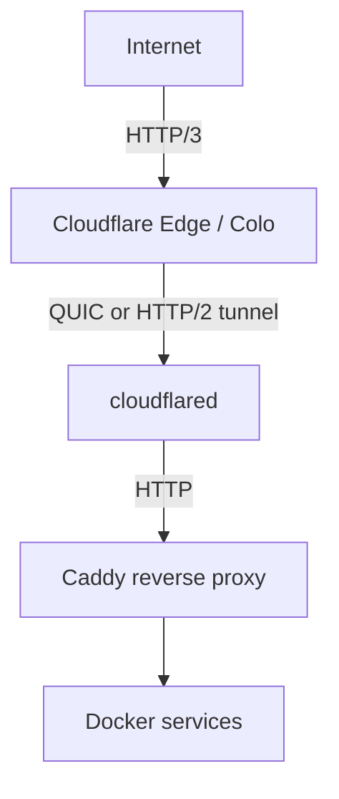

이사하고 인터넷을 새로 계약한 뒤 예상 못 한 문제가 하나 생겼습니다. `80`, `443` 포트가 막혀 있었습니다. 예전에는 "필요하면 포트 포워딩 열면 되지" 정도로 생각했는데, 이번에는 그 전제가 아예 깨졌습니다.

그래서 홈랩 공개 경로를 처음부터 다시 짜야 했습니다. 결론부터 쓰면 지금은 `Cloudflare Tunnel -> Caddy -> Docker`로 정착했습니다. 다만 여기까지 오는 동안 `k8s deployment`, `k3s`, `subdomain마다 cloudflared sidecar`, `Nginx Proxy Manager`를 차례로 거쳤습니다. 이 글은 정답 소개라기보다, 왜 점점 더 단순한 쪽으로 접었는지에 대한 기록입니다.

[^cf-tunnel]: Cloudflare Tunnel은 `cloudflared`가 Cloudflare 쪽으로 outbound-only 연결을 만들고, 공개 IP나 open inbound ports 없이 origin을 연결하는 모델로 설명됩니다. https://developers.cloudflare.com/tunnel/

---

## 1) 출발점: 포트를 열 수 없었다

제가 Cloudflare Tunnel을 보게 된 이유는 보안 철학보다 훨씬 현실적이었습니다. ISP가 `80`, `443`을 막아버리니, "외부에서 제 서버로 직접 들어오게 하는 구조" 자체를 포기해야 했습니다.

Cloudflare Tunnel은 이 상황에 꽤 잘 맞았습니다. `cloudflared`가 제 서버에서 먼저 Cloudflare로 outbound 연결을 만들고, 외부 요청은 Cloudflare Edge를 거쳐 그 연결로 내려옵니다.[^cf-tunnel] 즉 제 입장에서는 포트 포워딩, 공인 IP 노출, 집 공유기 inbound rule을 먼저 고민하지 않아도 됐습니다.

아래 그림이 지금 제가 쓰는 공개 경로입니다.



여기서 `HTTP/3`는 방문자와 Cloudflare Edge 사이 구간이고, tunnel 내부는 `cloudflared` 기본값 기준 `quic`을 우선 시도하다가 UDP가 막히면 `http2`로 fallback합니다.[^cf-http3][^cf-protocol]

[^cf-http3]: Cloudflare의 HTTP/3 문서는 이 설정을 "visitor와 Cloudflare 사이" 연결로 설명합니다. https://developers.cloudflare.com/speed/optimization/protocol/http3/
[^cf-protocol]: `cloudflared tunnel run`의 `--protocol` 기본값은 `auto`이며, 문서 기준으로 `quic`을 우선 사용하고 UDP 연결이 안 되면 `http2`로 fallback합니다. https://developers.cloudflare.com/tunnel/advanced/run-parameters/ , https://developers.cloudflare.com/tunnel/troubleshooting/

---

## 2) 첫 시도는 Kubernetes였다

처음에는 이걸 Kubernetes 안에서 풀려고 했습니다. 당시에는 이게 정답에 가깝다고 생각했습니다. 홈랩도 결국 서비스 몇 개를 배포하는 문제이니, `deployment` 하나 띄우고 ingress나 service와 묶으면 결국 해결될 줄 알았습니다. 그런데 그 판단이 틀렸습니다.

실패한 이유는 Cloudflare Tunnel이 아니라 **제가 운영하려는 시스템 크기**였습니다.

그 뒤에 `k3s`까지 올려봤지만, 냉정하게 보면 제 홈랩에서 상시 구동하는 웹서비스는 10개도 안 됐고 사용자도 저 하나였습니다. 이 정도 규모에서는 스케줄러, ingress, secret 배포, yaml 조합, 장애 복구 지점을 다 가져오는 쪽이 얻는 것보다 잃는 게 더 많았습니다.

제가 k8s에서 얻은 건 "확장 가능한 플랫폼"이라기보다 "언젠가 확장할 수도 있다는 가능성"이었고, 대신 지금 당장 감당해야 하는 운영 표면적은 훨씬 넓어졌습니다. 홈랩 첫 구성에서 그건 좋은 거래가 아니었습니다.

---

## 3) tunnel도 서비스마다 하나씩 붙이려 했다

k8s를 만지던 시기에는 subdomain마다 `cloudflared`를 sidecar처럼 붙이는 그림도 생각했습니다. 서비스 하나가 하나의 공개 hostname과 하나의 tunnel을 갖는 구조는 얼핏 보면 깔끔해 보입니다.

그런데 금방 생각이 바뀌었습니다.

첫째, tunnel은 무한 리소스가 아닙니다. 문서를 보니 `cloudflared` tunnel은 계정당 1,000개까지였습니다.[^cf-account-limits] 그래서 나중에 다시 보니 "무료 플랜이라 바로 숫자 제한에 막혔다"기보다는, 애초에 **서비스 하나당 tunnel 하나**라는 운영 단위를 제가 감당하고 싶지 않았던 쪽에 더 가까웠습니다.

둘째, 더 큰 문제는 개수보다 관리 단위였습니다. 서비스가 늘 때마다 tunnel, credential, 로그, 상태 확인 지점, 라우팅 규칙이 같이 늘어납니다. 저한테 필요한 건 그런 분산이 아니라 **공개 진입점은 하나로 두고, 내부 분기만 간단하게 관리하는 구조**였습니다.

[^cf-account-limits]: Cloudflare One account limits 문서 기준 `cloudflared` tunnels per account 한도는 `1,000`입니다. https://developers.cloudflare.com/cloudflare-one/account-limits/

---

## 4) 첫 성공은 Docker + Nginx Proxy Manager + cloudflared였다

처음으로 "이제 외부에서 실제로 붙는다"는 성공을 준 건 Kubernetes가 아니라 훨씬 단순한 조합이었습니다. `Docker + Nginx Proxy Manager + cloudflared`였습니다.

이 조합은 성공 이유도 명확했습니다.

- `cloudflared`는 Cloudflare와의 연결만 맡는다
- Nginx Proxy Manager는 hostname별 reverse proxy를 맡는다
- 각 서비스는 그냥 Docker 컨테이너로 둔다

즉 공개 경로와 내부 분기를 분리하되, UI로 빠르게 붙일 수 있었습니다. sidecar 방식처럼 tunnel 개념을 서비스마다 복제하지 않아도 됐고, k8s처럼 제어면 자체를 운영할 필요도 없었습니다.

다만 오래 쓸수록 마음에 안 드는 지점도 뚜렷했습니다. 설정을 보려면 web UI로 들어가야 했고, 제 용도에 비해 Node와 DB를 같이 끌고 가는 구성이 점점 불필요하게 느껴졌습니다. 게다가 제 경우 앞단에서 Cloudflare Access로 SSO를 구현해둔 상태였기 때문에, 로컬 reverse proxy가 또 별도의 관리 UI와 부가 스택을 품고 있을 이유가 더 약했습니다.

제 입장에서는 로컬 reverse proxy가 "화려한 관리자 제품"일 필요보다 "단순한 설정 파일"에 가까울수록 낫다고 판단했습니다.

---

## 5) 그래서 Caddy로 다시 바꿨다

결국 Nginx Proxy Manager도 접고 Caddy로 옮겼습니다. 이때 같이 한 일이 Docker network를 새로 하나 만든 것이었습니다. 웹으로 공개할 컨테이너 트래픽을 전부 그 네트워크로 옮기고, `cloudflared`와 Caddy를 그 앞단에만 두는 식으로 구조를 정리했습니다. 이 작업이 번거롭긴 했지만, 적어도 "외부 공개 경로를 타는 컨테이너"와 "그렇지 않은 컨테이너"를 네트워크 단위에서 나눠 생각할 수 있게 됐습니다.

지금 제가 유지하는 생각은 단순합니다.

- Tunnel은 공개 진입점 하나
- Caddy는 내부 분기 하나
- 실제 앱은 Docker 네트워크 안쪽

이렇게 나누면 서비스가 늘어나도 바뀌는 건 대체로 Caddyfile 한 줄입니다. 제 홈랩 규모에서는 이게 가장 중요했습니다. ingress controller도 아니고, 관리 UI도 아니고, 결국은 **"새 컨테이너 하나 띄우고 호스트명 하나 추가하면 끝나는가"** 였습니다.

개념상 구조는 아래 두 파일이면 거의 설명됩니다.

```yaml
# cloudflared/config.yml
ingress:
  - hostname: app.example.com
    service: http://caddy:80
  - hostname: grafana.example.com
    service: http://caddy:80
  - service: http_status:404
```

```caddyfile
app.example.com {
  reverse_proxy app:8080
}

grafana.example.com {
  reverse_proxy grafana:3000
}
```

결국 Tunnel은 "모든 공개 hostname을 Caddy로 모으는 역할"만 하고, 실제 서비스 분기는 Caddy가 담당합니다. 저는 이 분리가 가장 마음에 들었습니다.

---

## 6) 운영하면서 한계도 분명히 보였다

이 구조가 모든 서비스에 맞는 건 아니었습니다. 특히 파일 업로드가 핵심인 서비스는 금방 한계가 보였습니다. Cloudflare는 Free/Pro 플랜에서 request body 최대 크기를 `100 MB`로 제한합니다.[^cf-upload-limit]

즉 작은 웹앱, 대시보드, 관리 UI, 개인 서비스 몇 개를 공개하는 데는 꽤 잘 맞지만, 대용량 업로드가 핵심인 파일 서버를 같은 경로로 처리하는 건 처음부터 ceiling이 있습니다.

문서상 대안은 있었습니다. 요청을 더 잘게 쪼개거나, 업로드 경로만 unproxied DNS로 빼거나, 플랜을 올리는 방법입니다.[^cf-upload-limit] 다만 제 경우에는 파일 서비스를 따로 생각하는 편이 더 단순했습니다. 그래서 파일 서버는 `copyparty` 쪽으로 옮기기로 했습니다. 정확히는 "Cloudflare Tunnel 뒤의 일반 웹서비스"와 "대용량 파일 업로드"를 같은 문제로 보지 않게 된 겁니다. 이건 생각보다 중요한 분기였습니다.

[^cf-upload-limit]: Cloudflare 문서는 Free/Pro 플랜의 최대 request body 크기를 `100 MB`로 안내합니다. https://developers.cloudflare.com/workers/platform/limits/ , https://developers.cloudflare.com/support/troubleshooting/http-status-codes/4xx-client-error/error-413/

---

## 7) 지금은 이렇게 확인한다

구성을 바꾼 뒤에는 "정말 어디까지가 Cloudflare이고 어디부터가 제 서버인가"를 확인하는 습관도 같이 생겼습니다.

가장 자주 보는 건 `https://<host>/cdn-cgi/trace` 입니다. Cloudflare 공식 문서도 이 경로를 data center 확인용으로 안내합니다.[^cf-cdncgi][^cf-trace-colo] 제가 보는 값은 주로 세 가지입니다.

```bash
curl https://app.example.com/cdn-cgi/trace
```

- `colo`
- `http`
- `visit_scheme`

`colo`는 어떤 Cloudflare colo가 응답했는지 보여주고, `http`는 visitor-Edge 구간에서 어떤 HTTP 버전이 쓰였는지 보여줍니다. Cloudflare 문서의 trace 응답 예시에도 `colo=SJC`, `http=http/2`, `visit_scheme=https` 같은 필드가 등장합니다.[^cf-trace-fields]

회선 품질은 `speed.cloudflare.com`으로 따로 확인합니다. Cloudflare도 home network 테스트는 `speed.cloudflare.com`에서, 일반적인 사이트 속도 점검은 별도 speed 도구나 third-party 테스트로 보라고 안내합니다.[^cf-test-speed][^cf-aim]

[^cf-cdncgi]: Cloudflare는 `/cdn-cgi/` endpoint 문서에서 `/<YOUR_DOMAIN>/cdn-cgi/trace`를 Cloudflare data center 식별에 쓸 수 있다고 설명합니다. https://developers.cloudflare.com/fundamentals/reference/cdn-cgi-endpoint/
[^cf-trace-colo]: Support 문서도 `/<host>/cdn-cgi/trace`에서 `colo` 필드를 확인하라고 안내합니다. https://developers.cloudflare.com/support/troubleshooting/general-troubleshooting/gathering-information-for-troubleshooting-sites/
[^cf-trace-fields]: Cloudflare 문서의 `cloudflare.com/cdn-cgi/trace` 응답 예시에는 `visit_scheme=https`, `colo=SJC`, `http=http/2` 같은 필드가 포함되어 있습니다. https://developers.cloudflare.com/privacy-proxy/get-started/
[^cf-test-speed]: Cloudflare Fundamentals는 home network 테스트를 `speed.cloudflare.com`으로 안내하고, 사이트 속도 검증에는 Cloudflare speed 도구나 third-party 도구 사용을 함께 소개합니다. https://developers.cloudflare.com/fundamentals/performance/test-speed/
[^cf-aim]: `speed.cloudflare.com`의 AIM(Aggregated Internet Measurement)은 download/upload뿐 아니라 latency, loaded latency, packet loss, jitter까지 함께 봅니다. https://developers.cloudflare.com/speed/aim/

---

## 8) 지금 기준의 결론

돌아보면 제 홈랩에서 문제는 "어떻게든 외부 공개를 할 수 있느냐"가 아니었습니다. **제 규모에 맞는 운영 단위를 어디에 둘 것이냐**가 더 큰 문제였습니다.

- k8s는 너무 컸습니다.
- subdomain마다 tunnel은 운영 단위가 너무 잘게 쪼개졌습니다.
- Nginx Proxy Manager는 처음 성공을 줬지만 오래 들고 가기엔 무거웠습니다.
- 결국 `Cloudflare Tunnel -> Caddy -> Docker network`가 제 상황에는 가장 맞았습니다.

상시 구동 웹서비스가 10개 미만이고 사용자도 저 하나라면, 제가 얻고 싶은 건 오케스트레이션이 아니라 예측 가능한 단순함이었습니다. 이 글을 쓰고 보니 제가 정착한 구조는 아주 새롭지도 않고 화려하지도 않습니다. 대신 고장 났을 때 어디를 봐야 하는지 분명하고, 서비스가 하나 늘어났을 때 어떤 파일을 수정해야 하는지도 분명합니다.

지금 기준에서는 그 정도면 충분합니다.
